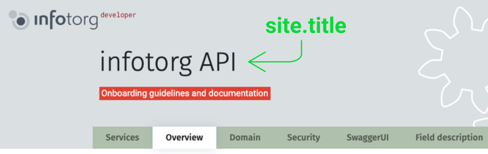
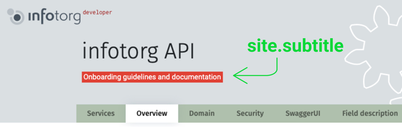
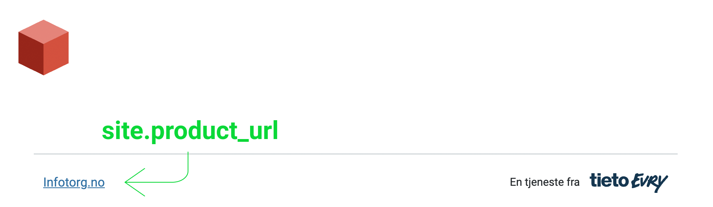
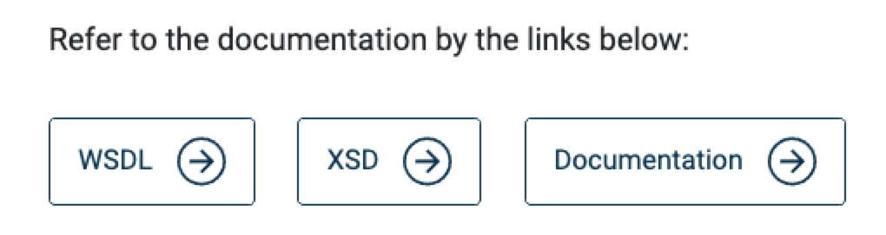
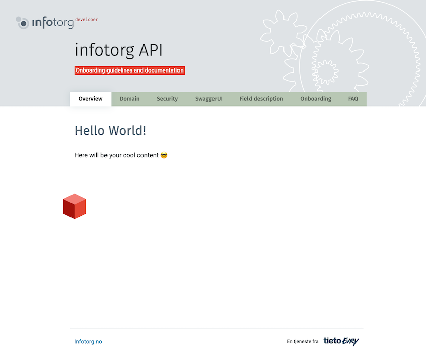
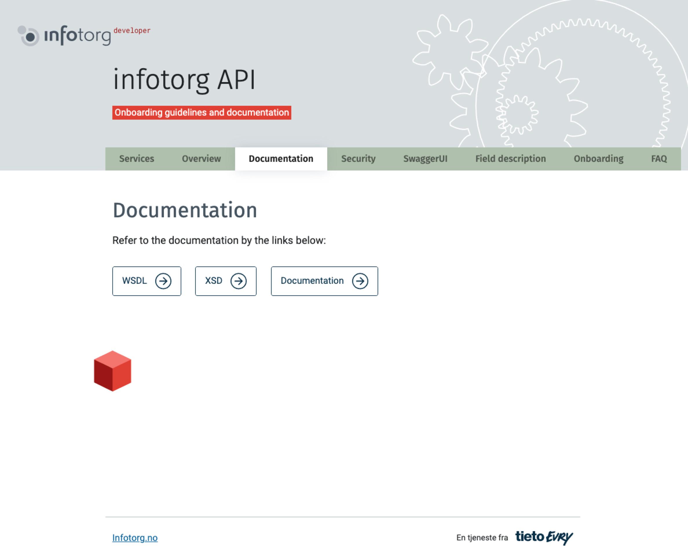
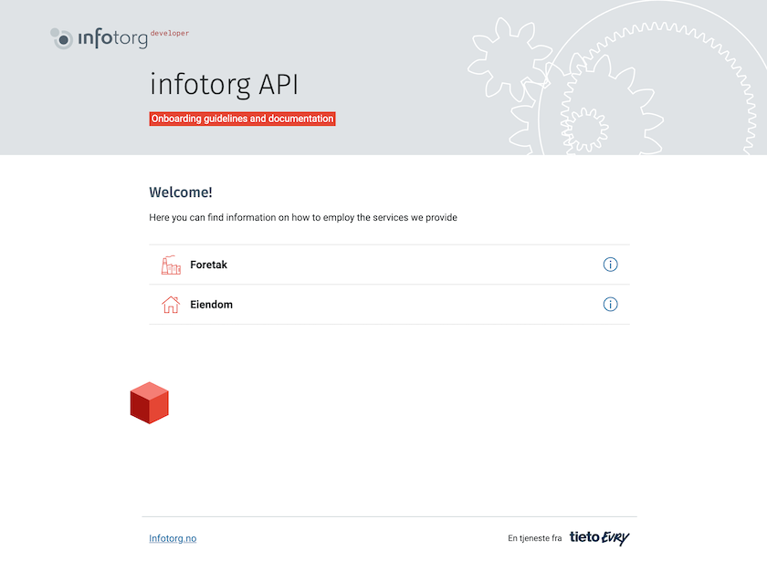
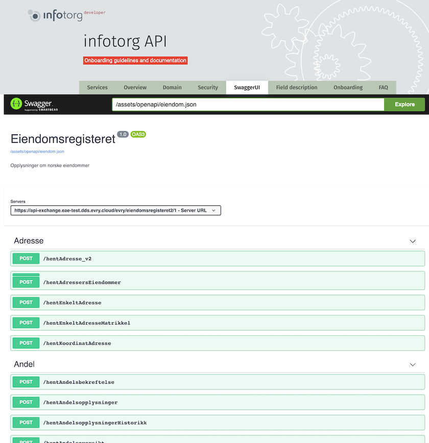

# Jekyll Infotorg APIs theme

> Scaffold for a basic Jekyll theme for use as a reference or template

[](https://ruby-lang.org)
[](https://jekyllrb.com)
[](https://getbootstrap.com/)
[](#license)

Infotorg API Jekyll theme has been developed as a [Gem-based](http://jekyllrb.com/docs/themes/) theme for easier use, 
and 100% compatible with GitHub Pages when used as a remote theme.

[Theme preview](https://coderua.github.io/infotorg-api-jekyll-theme/)


## How to use this project

### Quickstart

Create a new project from this template. Or just use the code or docs here as a reference.

<div align="center">

[](https://github.com/coderua/infotorg-api-jekyll-theme/generate)

</div>

### Remove the Unnecessary
If you forked or downloaded the theme repo you can safely remove the following folders and files:

- `/docs`
- `infotorg-api-jekyll-theme.gemspec`
- `README.md`
- `screenshot.png`
- any not needed files from `/pages` folder
- update `_data/navigation.yml` file

### Demo

View a live demo on GitHub Pages:

<div align="center">

[](https://coderua.github.io/infotorg-api-jekyll-theme/)

</div>

## What is a Jekyll theme?

If you build a Jekyll site, you'll typically use a theme to style your site or at least give a base which you and customize on top of.

A theme is a way of packaging layout files, CSS styling and includes files to be installed in another Jekyll project. A theme might be made from scratch or based on a static HTML. A theme is a great way of making styling reusable across projects by you and other people.

A good example of a theme is Minima, which is the default theme used when running `jekyll new PATH`.

[](https://github.com/jekyll/minima)

## About

### Package a theme

The part that allows this project gem to be packaged as an installable gem-based theme is this file:

- [infotorg-api-jekyll-theme.gemspec](/infotorg-api-jekyll-theme.gemspec)

The other parts like the config and Gemfile or the layout and includes directories are standard for a Jekyll project.

Resources:

- [Creating a gem-based theme](https://jekyllrb.com/docs/themes/#creating-a-gem-based-theme) in Jekyll docs.
- [Publishing your theme](https://jekyllrb.com/docs/themes/#publishing-your-theme) in Jekyll docs.
- [Adding a theme to your GitHub Pages site using Jekyll](https://help.github.com/en/github/working-with-github-pages/adding-a-theme-to-your-github-pages-site-using-jekyll) guide on Github's help.

## Installation

>  Install this theme in your project

There are three ways to install: as a [gem-based theme](https://jekyllrb.com/docs/themes/#understanding-gem-based-themes), as a [remote theme](https://github.blog/2017-11-29-use-any-theme-with-github-pages/) (GitHub Pages compatible), or [forking](https://github.com/coderua/infotorg-api-jekyll-theme/generate)/directly copying all of the theme files into your project.

### Remote Theme method

Only a few [standard themes](https://pages.github.com/themes/) are available on the locked GH Pages environment. 
So you must use this Remote Theme plugin to fetch your custom theme.

Use the [remote theme](https://github.com/benbalter/jekyll-remote-theme) approach to load a theme using GitHub details.

`_config.yml`

```yaml
####
# --- Required configuration ---
####

# Set a branch name or version at the `remote_theme` value e.g. `@main` or `@v1.0.0`.
# Be careful if you omit the branch then automatically will be used `master`. 
remote_theme: "infotorg/infotorg-api-jekyll-theme@main"
plugins:
  - jekyll-remote-theme
  - jekyll-seo-tag
```
Other available options can be added later. See [[Configuration](#configuration)] section.

Continue to [Install project gems](#install-project-gems)

### Gem-based method

While gems are locked on GH Pages, you can install custom gems like a theme if you use a CI flow. Such as with GH Actions or Netlifym.

With Gem-based themes, directories such as the assets, `_layouts`, `_includes`, and `_sass` are stored in the theme’s gem, hidden from your immediate view. Yet all of the necessary directories will be read and processed during Jekyll’s build process.

#### 1. Add to your config

Update your project's `_config.yaml`:

```yaml
####
# --- Required configuration ---
####
theme: infotorg-api-jekyll-theme
```

Other available options can be added later. See [[Configuration](#configuration)] section.

#### 2. Add to Gemfile

To install from **RubyGems**:

- `Gemfile`
  
  ```ruby
  source "https://rubygems.org"
  
  gem "github-pages"
  gem "infotorg-api-jekyll-theme"
  ```

To install from **GitHub**:

- `Gemfile`
  
  ```ruby
  source "https://rubygems.org"
  
  gem "github-pages"
  gem "infotorg-api-jekyll-theme", git: "https://github.com/coderua/infotorg-api-jekyll-theme", branch: 'main'
  ```

### Install project gems

Now install your gems locally. This is also needed on GH Actions. Netlify takes care of gems for you though.

Configure Bundler locally - only needed once.

```sh
$ bundle config set --local path vendor/bundle
```

Install project gems.

```sh
$ bundle install
```

### Development and testing
To set up your environment to develop this theme, run `bundle install`.

To test the theme, run `bundle exec jekyll serve --livereload --trace` and open your browser at [http://localhost:4000/](http://localhost:4000/). This starts a Jekyll server. As modifications are made to the theme and test site, it will regenerate and you should see the changes in the browser without a refresh.

### Installed path

Useful info for understanding where your theme gets installed based on the approach.

#### GH Pages supported theme

Themes downloaded from RubyGems usually install here:

- `vendor/bundle/ruby/RUBY_VERSION/gems/THEME_NAME-THEME_VERSION`

#### Remote Theme method

The Remote Theme plugin stores the theme in memory and not on disk with gems.

#### Gem-based method

If you added your theme to your Gemfile directly and installed from GitHub URL, it will get installed here:

```
vendor/bundle/ruby/RUBY_VERSION/bundler/gems/THEME_NAME-THEME_VERSION
```

Where the version at the end is a hash (`123456789abc`) or a tag number (`1.0.0`).

### Installed dependencies

See the [gemspec](/infotorg-api-jekyll-theme.gemspec) file to see what dependencies get installed. This came with the scaffold. Update minimum Jekyll version.

## Contents At-A-Glance

### Configuration

Settings that affect your entire site can be changed in [Jekyll’s configuration file](https://jekyllrb.com/docs/configuration/): `_config.yml`, found in the root of your project. If you don’t have this file you’ll need to copy or create one using the theme’s default [_config.yml](_config.yml) as a base.

>**Note:** for technical reasons, _config.yml is NOT reloaded automatically when used with jekyll serve. If you make any changes to this file, please restart the server process for them to be applied.

Take a moment to look over the configuration file included with the theme. Comments have been added to provide examples and default values for most settings.

##### Front Matter Defaults
To save yourself time setting [Front Matter Defaults](https://jekyllrb.com/docs/configuration/front-matter-defaults/) for pages is the way to go. Sure you can assign `layout` and toggle settings like `show_navigation`in each file, but that’s not ideal.

Using the `default` key in [_config.yml](_config.yml) you could set the `layout` and enable/disable navigation for all pages — in one shot.

Instead of adding `layout: "default"` and `show_navigation: true` to each page, apply as defaults in like so:

`_config.yml`
```yaml
defaults:
  - scope:
      path: ""
    values:
      layout: "default"
      show_navigation: true
```

To change `layout` add `layout: <LAYOUT_NAME>` to its YAML Front Matter, overriding what was set in _config.yml.
The same with the `show_navigation`.

Example:
```yaml
---
layout: layout_name
show_navigation: false
---
````

##### Site language

[site.lang](_config.yml) is used to declare the primary language for each web page within the site.

Example: `lang: "en-US"` sets the lang attribute for the site to the United States flavor of English, while `en-GB` would be for the United Kingdom style of English. Country codes are optional and the shorter variation `lang: "en"` is also acceptable. 
To find your language and country codes check this [reference table](https://msdn.microsoft.com/en-us/library/ee825488(v=cs.20).aspx).

`_config.yml`:
```yaml
lang: "en-US"
```


##### Site Title or *Main Heading*

[site.title](_config.yml) is used to set a heading title for a page.

`_config.yml`:
```yaml
title: infotorg API
```



It used as a part of title in a `<title>` tag as well.
Let's imagine we have a "Security" page that looks like:

`pages/security.md`
```markdown
---
title: Security
---

# The Security Guideline

Some other content...
```

And a configuration in the `_config.yml`:
```yaml
#...

title: infotorg API

#...
```

As a result, in the html output we'll have a `page.title` and `site.title` together, separated by ` | ` delimiter.
```html
<title>Security | infotorg API</title>
```

This is achieved by using [jekyll-seo-tag](https://github.com/jekyll/jekyll-seo-tag) plugin.


#### Site Subtitle

The `site.subtitle` sets a visible subtitle under the title on the page.

`_config.yml`:
```yaml
subtitle: Onboarding guidelines and documentation
```



#### Url to a Product page

`product_url` used to set a direct **url** to a product on the Infotorg.no website. *Default:* https://www.infotorg.no/

`_config.yml`:
```yaml
product_url: "https://www.infotorg.no/"
```

`product_url_title` used to set Sets the product link **title**. *Default:* Infotorg.no

`_config.yml`:
```yaml
product_url_title: "Infotorg.no"
```




#### Enabling Google Analytics
To enable Google Analytics, add the following lines to your Jekyll site:
```yaml
google_analytics_tag_manager: GTM-XXXX
```


### Navigation


Customize a site navigational links through a Jekyll data file [_data/navigation.yml](_data/navigation.yml)

```yaml
- name: Overview
  link: /
  show: true

- name: Security
  link: /security
  show: true

- name: Onboarding
  link: /onboarding
  show: false # won't be presented in a navigation

- name: FAQ
  link: https://faq.socialboards.com/infotorg/
  target: _blank # will opened in a new tab
  show: true
```

Optional keys:
- `target` - adds a `target` html attribute to a navigation link. Possible values are: `_self`, `_blank`, `_parent`, `_top`. [[More details](https://developer.mozilla.org/en-US/docs/Web/HTML/Element/a)]
- `show` - Boolean flag shows/hides the navigation item. Possible values: `true`, `false`.


### External documentation links

The theme gives you an ability to easily show links to external documentation resources.



#### How to use it
1. Create a file with links to the documentation resources. By default, this is [_data/documentation_links.yml](_data/documentation_links.yml).

  `_data/documentation_links.yml` 
  ```yaml
  - name: WSDL
    link: http://ws-test.infotorg.no/xml/EVRY/InfotorgKjoeretoey/2018-11-28/InfotorgKjoeretoey.wsdl
    target: _blank
    show: true
  
  - name: XSD
    link: http://ws-test.infotorg.no/xml/EVRY/InfotorgKjoeretoey/2018-11-28/InfotorgKjoeretoey.xsd
    target: _blank
    show: true
  
  - name: Documentation
    link: http://ws-test.infotorg.no/xml/EVRY/InfotorgKjoeretoey/2018-11-28/InfotorgKjoeretoey.xsd.xhtml
    target: _blank
    show: true  
  ```
  Optional keys:
  - `target` - adds a `target` html attribute to a navigation link. Possible values are: `_self`, `_blank`, `_parent`, `_top`. [[More details](https://developer.mozilla.org/en-US/docs/Web/HTML/Element/a)]
  - `show` - Boolean flag shows/hides the item. Possible values: `true`, `false`.
2. On a page you need the resources link use [documentation](_layouts/documentation.html) layout
```yaml
---
layout: documentation
title: Documentation
permalink: documentation
---
```

Or you can manually include documentations links instead of using layout.
```html
---
title: Documentation
permalink: documentation
---
<h1>{{ page.title }}</h1>


```
[documentation_links](_includes/documentation_links.html) requires only links [[see step 1 above](#how-to-use-it)].

> NOTE: a page where you're including the `documentation_links` should have the `.html` extension, not `.md`.


### Layouts

The bread and butter of any theme. Below you’ll find the layouts included with the theme, what they look like and the type of content they’ve been built for.

> **NOTE:** The theme is based on [Bootstrap](https://getbootstrap.com/docs/5.0/getting-started/download/) **v5.0.0-beta1**.
>
> Feel free to use any Bootstrap features in your sites.

Refers to files within the [_layouts](_layouts) directory, that define the markup for your theme.

- [default.html](_layouts/default.html) &mdash; The base layout that lays the foundation for subsequent layouts. The derived layouts inject their contents into this file at the line that says ` {{ content }} ` and are linked to this file via [FrontMatter](https://jekyllrb.com/docs/frontmatter/) declaration `layout: default`.
- [documentation.html](_layouts/documentation.html) &mdash; The layout for automatic output external documentation links. [[More Info.](#documentation-layout)]
- [services.html](_layouts/services.html) &mdash; The layout for your Services list. [[More Info.](#services-layout)]
- [swagger-ui.html](_layouts/swagger-ui.html) &mdash; The layout for your [Swagger UI](https://swagger.io/tools/swagger-ui/) documentation that contain FrontMatter: `layout: swagger-ui`. [[More Info.](#swagger-ui-layout)]

Each of the layouts injects all needed CSS and JavaScript to render your page correctly.

#### Default Layout

[`default.html`](_layouts/default.html) is a flexible HTML layout for the site's landing-page / home-page / index-page. <br/>



#### Documentation Layout

[documentation.html](_layouts/documentation.html) based on the default layout to show a list of links to external documentation defined in the [_data/documentation_links.yml](_data/documentation_links.yml) file.



#### Services Layout

[services.html](_layouts/services.html) based on the default layout to show a list of services defined in the [_data/services.yml](_data/services.yml) file.



#### Swagger UI Layout

[services.html](_layouts/services.html) is a flexible HTML layout for the to show Swagger UI.



Path to Open API file can be set in the `openapi` option in the [_config.yml](_config.yml) or via FrontMatter: `openapi: /assets/openapi/YOUR_OPEN_API_FILE`

`pages/swagger-ui.html`
```yaml
---
layout: swagger-ui
title: Swagger UI
permalink: swagger-ui
openapi: /assets/openapi/YOUR_OPEN_API_FILE
---
```

> **NOTE:** As a convention, all Open API files should be stored in the `/assets/openapi` folder.


### Includes

Refers to snippets of code within the [_includes](_includes) directory that can be inserted in multiple layouts (and another include-file as well) within the same theme-gem.

- [footer.html](_includes/footer.html) &mdash; Defines the site's footer section.
- [head-app-css.html](_includes/head-app-css.html) &mdash; Inserts CSS links.
- [head-favicon.html](_includes/head-favicon.html) &mdash; Inserts favicons for different sizes. Icons are located in the [/assets/images/favicon](/assets/images/favicon) directory
- [head-fonts.html](_includes/head-fonts.html) &mdash; Inserts fonts.
- [head-google-analytics.html](_includes/head-google-analytics.html) &mdash; Inserts Google Analytics module.
- [navigation.html](_includes/navigation.html) &mdash; Inserts navigation block (for desktop and mobile devices). Managing by [show_navigation](_config.yml) option in a global [_config.yml](_config.yml) or via FrontMatter: `show_navigation: true/false`
- [title.html](_includes/title.html) &mdash; Defines the site's main header section.
- [documentation_links.html](_includes/documentation_links.html) &mdash; Output [external documentation links](#external-documentation-links).

### Sass

Refers to `.scss` files within the [_sass](_sass) directory that define the theme's styles.

- [_variables.scss](_sass/_variables.scss) &mdash; SCSS variables which can be used anywhere in SCSS files.
- [_bootstrap.scss](_sass/_bootstrap.scss) &mdash; Bootstrap main file.
- [_bootstrap_variables.scss](_sass/_bootstrap.scss) &mdash; Used to configure bootstrap defaults.
- [_typography.scss](_sass/_typography.scss) &mdash; Basic typography styles.

### Assets

Refers to various asset files within the [assets](assets) directory.

- [assets/css/main.scss](assets/css/main.scss) &mdash; Imports sass files from within the `_sass` directory and gets processed into the theme's
  stylesheet: `assets/css/main.css`.
- [assets/css/print.scss](assets/css/print.scss) &mdash; Print related styles and gets processed into the theme's
  stylesheet: `assets/css/print.css`
- [assets/images](assets/images) &mdash; A folder with image assets.
- [assets/images/favicon](assets/images/favicon) &mdash; A folder contains image assets for favicon.
- [assets/images/icons](assets/images/icons) &mdash; A folder contains icon image assets.
- [assets/images/icons/services](assets/images/icons/services) &mdash; A folder contains Infotorg API Services icons. *By default used in the [services layout](#services-layout).

### Plugins

The theme comes with [jekyll-seo-tag](https://github.com/jekyll/jekyll-seo-tag) plugin preinstalled to make sure your website gets the most useful meta tags. See [usage](https://github.com/jekyll/jekyll-seo-tag#usage) to know how to set it up.


## License

Distributed under the [MIT License](LICENSE.md).
