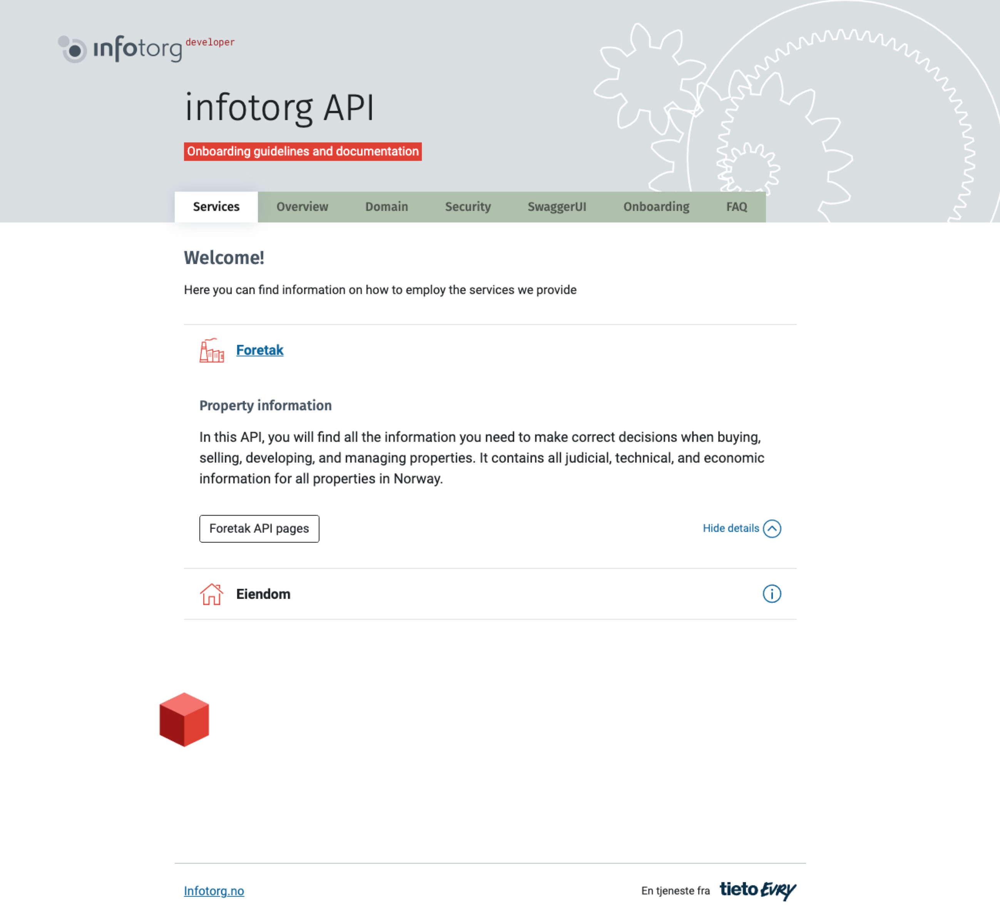

# Jekyll theme for Infotorg APIs

## How to use this project

### Quickstart

Create a new project from this template. Or just use the code or docs here as a reference.

### Demo

View a live demo on GH Pages:

